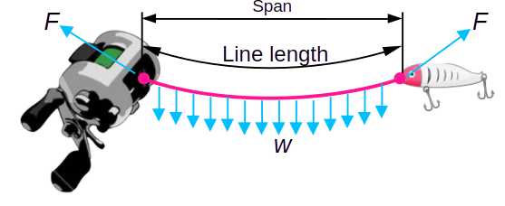
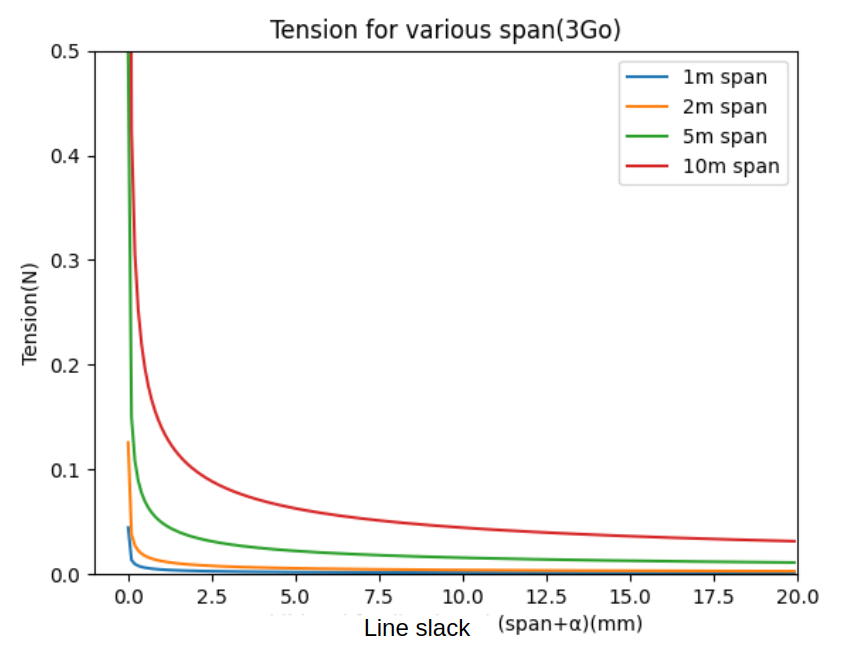
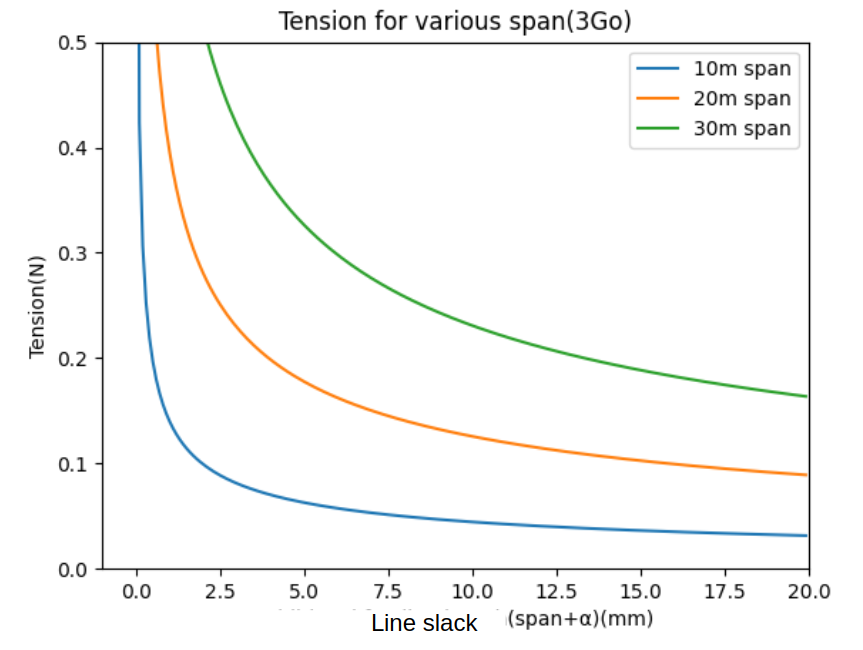
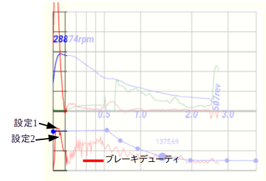

# Technology Disclosure

## 概要
ルアー・ライン・スプールで構成されるリール系のキャスト時の状態として、順に遷移する以下の３状態を定義する。
<table>
<tr><th>状態<th>制御方法<th>遷移条件</tr>
<tr><td>①加速状態<td>制御ナシまたは過回転(2)抑制<td>張力比較</tr>
<tr><td>②小スパン(1)状態<td>スライディングモード制御<td>経過時間</tr>
<tr><td>③大スパン状態 <td>PI-D制御<td>---</tr>
<tr><td colspan="3"></tr>
</table>

### 注釈
<dl>
<dt>1)スパン</dt>
<dd>ルアーとロッド間の距離。この間に水平に張られた、重量が無視できない糸(ピンク)の静力学的な<b>力の釣り合い</b>は、ラインが受ける重力による分布荷重(<i>w</i>)とライン両端での支持力(<i>F</i>)が釣り合った状態にある。
 
 
重力を受けるラインは、図のように懸垂線を描き、またラインの張力は支持力(<i>F</i>)に等しい。ここで、ライン長とスパンの差を『ラインスラック(slack:弛み)』と定義すると、ラインスラックと張力の関係は、下図のようになることが知られている。 
<table>
<tr><td><td></tr>
</table>
スパンが数ｍの範囲では(図左)、ラインスラックに対する張力変化が非常に大きく、張力が安定しにくい。一方、スパンが10ｍ以上になると、勾配は一気に緩やかになり、張力は自ずと安定しやすくなる(図右)。 
このような系の特性に合わせて、制御方法を切り替えることが必要である。
</dd>
<dt> 2)過回転</dt>
<dd>低慣性スプールで力を入れたキャストをしたとき、スプール速度がルアー速度を上回ることがある。この状態が継続すると、即時にバックラッシュやライン切れが起きる。</dd>
</dl>

## 設計
### 状態①加速  
#### 要求実現
1. 低初速(初速が閾値以下)では、スプールの回転を阻害しないよう、ブレーキは完全OFF  
例えば、スプール回転15000RPM以下ではブレーキOFF
2. 高初速(初速が閾値以上)では、強いブレーキを作用しスプール回転を抑制  
スプール回転がルアー速度を超えると、致命的なバックラッシュやライン切れが発生しやすい
初速の高低により、サブ状態を以下のように切り替える。
<table>
<tr><th rowspan="2">サブ状態<th colspan="2">遷移条件
<tr><th>低初速<th>高初速<th>ブレーキ<td rowspan="4">
</tr>
<tr><th>1<td>張力&lt;閾値1<td>スプール回転速度&gt;閾値2<td>0</tr>
<tr><th>2<td rowspan="2" align="center">↓<td>張力&lt;閾値1<td>設定1</tr>
<tr><th>3<td>張力 - 張力極小値&gt;閾値3<td>設定2</tr>
</table>

3. ブレーキ設定1  
1回転のうちのブレーキ作動時間(FETターンオン時間)を指示する。設定プロファイルは無視する。
センサーレスユニットの場合は、次の周期を予測し、その前にターンオフする必要があり、実現には配慮が必要。下記の回転予測時間 <i>&Delta;t1</i>を求め、最大でもその6/7以下のターンオン時間とする。

$$
\Delta t_1=\frac{v_0-v_0\sqrt(1+\frac{2 \alpha d_0}{v_0^2})}{\alpha}\\
$$
$$
\begin{align}
\alpha&=-\Delta t_0+\Delta t_{-1}\\
v_0&=-\Delta t_0 \Delta t_0+\Delta t_{-1} \Delta t_{-1}+2 \Delta t_0 \Delta t_{-1}\\
d_0&=\Delta t_0 \Delta t_{-1} (\Delta t_0+\Delta t_{-1})\\
\end{align}
$$
近似解として
$$
\Delta t_1=\frac{d_0}{v_0}-\frac{\alpha d_0^2}{4v_0^3}   approx.
$$

### 状態②小スパン  
#### 概要
状態①での制御が成功していれば、この状態の初期には
  - ルアー速度 > スプール速度

が成立している。上記速度条件では、必ずラインを介してルアーとスプールの衝突が起きる。張力波形には、この時発生する力積 *F&Delta;t* が観察されるため、条件成立を確認できる。

#### 要求実現  
1. スライディングモード制御

$$
\sigma=(\beta-\beta_{REF})+\frac{D_{\Theta}}{\omega}\dot{\beta}
$$
スライディングモード制御は、&sigma;(スイッチング関数)の符号により２値に制御入力$U$を切り替える。
$$
U=\begin{cases}
U_{Low} & \sigma>0 &  低デューティ\\
U_{High} & \sigma<0 &  高デューティ
\end{cases}
$$
2. 高デューティ一のアダプテーション
高デューティ一は設定プロファイル$U_{Prof}$を上限に、下式にてアダプテーションする。
$$
\Delta U_{High} =\begin{cases}
-k_{Adap} U_{High} \beta \Delta t & \sigma>0\\
0 & \sigma<0
\end{cases}
$$

### 状態③スパン大  
#### 概要
状態③での制御は、張力がほぼ０の状態で行うため、ゼロ点ズレなど誤差の影響が大である。このため張力ではなく「ライン張度」という、特定周波数範囲の張力変動にて、閉ループ系を構成する。

#### 要求実現  

1. PI-D制御  
Dは微分(Differential)ではなく、ディザリング(Dithering)の**D**。制御構造はPI制御であるが、フィードバックするのは、張力ではなく「ライン張度」である。

2. ディザリング  
ディザリングとは、信号に意図的にノイズ(ディザー)を加えることであり、本件ではブレーキデューティに一定周期(5Hz)の三角波ディザーを加える。ディザーの目的は、ディザーに対する系の応答(張力)を観測し、周波数分析からライン張度を得る。

3. ライン張度  
上図に示すように、振幅Aのディザーをブレーキに加えたときの張力応答は、張力が高いときには振幅B1、張力が低いときには振幅B2、となり同じディザー振幅に対して応答振幅が大きく変わる。この特性を利用してラインの張り具合を数値化したものが「ライン張度」である。

4. 高次回帰フィルター  
ディザー周波数以外の張力変動はフィルターでカットする。この手順は、ディザー周期と同じウインドウに観測データを切り出し、このデータに対して高次の回帰式を求め、その誤差(σ)を『ライン張度』と定める。即ち、ライン張度は、5Hz〜オブザーバ応答周波数での張力バラツキ(標準偏差)である。

