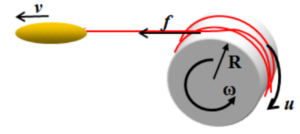

# Technology Disclosure

## 0. 予備知識
制御設計にあたって、予備知識を共有する。

- ラインの静力学
２点間に水平に張られた、重量が無視できない糸(ピンク)の<b>力の釣り合い</b>は、ラインに働く重力による分布荷重(<i>w</i>)とライン両端での支持力(<i>F</i>)が釣り合った状態にある。また支持力(<i>F</i>)はライン張力と釣り合っている。
 
 
このような状態にある糸は、懸垂線と呼ばれる形状を描くことが知られている。懸垂線の研究は確立されており、ライン長(Line length)とスパン(Span)の差を『ラインスラック(slack:弛み)』と定義すると、ラインスラックと張力の関係は、下図のようになる。 
スパンが数ｍの範囲(左下図)では、ラインスラックに対する張力変化が非常に大きく、張力が安定しにくい。一方、スパンが10ｍ以上になると、勾配は一気に緩やかになり、張力は自ずと安定しやすくなる(右下図)。 
このような系の特性に合わせて、制御方法を切り替えることが必要である。
<table>
<tr><td><td></tr>
</table>

- リールの動力学とオブザーバ
直接計測が出来ない状態量を、計測可能な量から推定する場合に、オブザーバという技術が使われる。本件は以下のような力学系に対して、オブザーバを適用することで張力$f$を推定します。  
詳細は [こちらのリンクから](Observer.md)

## 1. 制御構造
ベイトリール系のキャスト時の以下の３状態に対応じた制御構造とする。
<table>
<tr><th>状態<th>制御方法<th>遷移条件</tr>
<tr><td>①加速状態<td>制御ナシまたは過回転(1)抑制<td>張力比較</tr>
<tr><td>②小スパン状態<td>スライディングモード制御<td>経過時間(0.15秒)</tr>
<tr><td>③大スパン状態 <td>PI制御+ディザリング<td>なし</tr>
<tr><td colspan="3"></tr>
</table>

<dt>1)過回転</dt>
<dd>低慣性スプールで力を入れたキャストをしたとき、スプール速度がルアー速度を上回ることがある。この状態が継続すると、即時にバックラッシュやライン切れが起きる。</dd>
</dl>

## 2. 要求実現

### ①加速状態  
1. 低初速(初速が閾値以下)では、スプールの回転を阻害しないよう、ブレーキは完全OFF  
例えば、スプール回転15000RPM以下ではブレーキOFF
2. 高初速(初速が閾値以上)では、強いブレーキを作用しスプール回転を抑制  
スプール回転がルアー速度を超えると、致命的なバックラッシュやライン切れが発生しやすい
初速の高低により、サブ状態を以下のように切り替える。
<table>
<tr><th rowspan="2">サブ状態<th colspan="2">遷移条件
<tr><th>低初速<th>高初速<th>ブレーキ<td rowspan="4">
</tr>
<tr><th>1<td>張力&lt;閾値1<td>スプール回転速度&gt;閾値2<td>0</tr>
<tr><th>2<td rowspan="2" align="center">↓<td>張力&lt;閾値1<td>設定1</tr>
<tr><th>3<td>張力 - 張力極小値&gt;閾値3<td>設定2</tr>
</table>

3. ブレーキ設定1  
1回転のうちのブレーキ作動時間(FETターンオン時間)を指示する。設定プロファイルは無視する。
センサーレスユニットの場合は、次の周期を予測し、その前にターンオフする必要があり、実現には配慮が必要。下記の回転予測時間 <i>&Delta;t1</i>を求め、最大でもその6/7以下のターンオン時間とする。

$$
\begin{align}
\Delta t_1&=\frac{v_0-v_0\sqrt(1+\frac{2 \alpha d_0}{v_0^2})}{\alpha}\\
&\alpha=-\Delta t_0+\Delta t_{-1}\\
&v_0=-\Delta t_0 \Delta t_0+\Delta t_{-1} \Delta t_{-1}+2 \Delta t_0 \Delta t_{-1}\\
&d_0=\Delta t_0 \Delta t_{-1} (\Delta t_0+\Delta t_{-1})\\
\end{align}
$$
以下は近似解を与える
$$
\Delta t_1=\frac{d_0}{v_0}-\frac{\alpha d_0^2}{4v_0^3}
$$

### ②小スパン状態  

1. スライディングモード制御

$$
\sigma=(\beta-\beta_{REF})+\frac{D_{\Theta}}{\omega}\dot{\beta}
$$
スライディングモード制御は、&sigma;(スイッチング関数)の符号により２値に制御入力$U$を切り替える。
$$
U=\begin{cases}
U_{Low} & \sigma>0 &  低デューティ\\
U_{High} & \sigma<0 &  高デューティ
\end{cases}
$$
2. 高デューティ一のアダプテーション
状態②の継続時間は非常に短い(0.1〜0.2秒)ため、高デューティ一をブレーキ過剰と感じることはないと考えられるが、必要なら下式にてアダプテーション(積分)してもよい。
$$
\Delta U_{High} =\begin{cases}
-k_{Adap} U_{High} \beta \Delta t & \sigma>0\\
0 & \sigma<0
\end{cases}
$$

### ③大スパン状態 

1. 微小張力の計測
状態③の制御は、張力がほぼ０の状態で行うため、ゼロ点ズレなど誤差の影響が大となる。このため張力そのものではなく、張力の周波数応答にてラインの張り具合を評価する。
2. ディザリング
ディザリングとは、信号に意図的にノイズ(ディザー)を加えることであり、本件ではブレーキデューティに一定周期(5Hz)の三角波ディザーを加える。これにより、ディザー周波数の張力振動をフィルタすることで、使用条件に依存しないライン張度を得ることが出来る。

3. フィードバック  
「ライン張度」をPI制御フィードバックする『PI-D制御』を適用する。ただし、Dは微分(Differential)ではなく、ディザリング(Dithering)の**D**。

4. フィルター処理
    - 原理
    下図に、ラインスラックと張力の関係を示す。振幅Aのディザーを加えたときの張力応答は、張力が高いときには振幅B1、張力が低いときには振幅B2、となり、同じディザー振幅に対して応答振幅が大きく変化する。このような懸垂線の特性を利用して、微小張力を計測する。

    - 周波数フィルター  
    ディザーに対する応答のみを得るため、ディザー周波数以外の振動をフィルターでカットする。フィルタは、ディザー周期と同じウィンドウにて、高次回帰(2〜3次)の誤差総和((つまりσ)とする。

